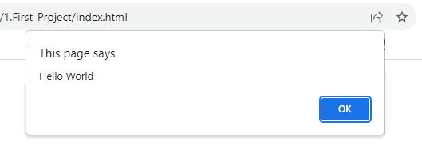

# TypeScript Tutorial


## What is TypeScript?

TypeScript, an open-source programming language, is crafted and nurtured by Microsoft. It extends JavaScript's capabilities by introducing static typing and additional features, all the while ensuring seamless compatibility with existing JavaScript code.

```
TypeScript = JavaScript + A type system
```

The TypeScript type system encompasses the following aspects:

- It aids in error detection during the development phase.
- It employs 'type annotations' to scrutinize our code.
- Its functionality is solely active during development.
- It does not offer any performance optimizations.

**TypeScript Process**
1. Write TypeScript Code
	```typescript
	function addNumbers(a: number, b: number): number {
        return a + b;
	}
	const sum: number = addNumbers(5, 10);
	console.log(`The sum is: ${sum}`);
	```
	
2. Use the TypeScript Compiler (tsc) to Transform TypeScript Code into Plain JavaScript
	
	```javascript
	"use strict";
	function addNumbers(a, b) {
	    return a + b;
	}
	const sum = addNumbers(5, 10);
	console.log(`The sum is: ${sum}`);
	```

## Installing the TypeScript Compiler

Install Node.js by following this [Link](https://nodejs.org/en), and then execute the following command in your terminal:

```bash
npm install -g typescript
```

To use the TypeScript Compiler, execute the following command in your terminal:

```bash
tsc script.js
```

## First Project

Generate an `index.html` file containing the following code:

```html
<!DOCTYPE html>
<html>
<head>
    <title>TypeScript Tutorial</title>
    <script></script>
</head>
<body>
    <h1>Run TypeScript Compiler</h1>
    <script src="script.js"></script>
</body>
</html>
```

Next, create a `script.ts` file and include the following code:

```typescript
let message: string = 'Hello World';
alert(message)
```

For compile TypeScript to Javascript, execute the following command in your terminal:

```bash
tsc script.ts
```

Finally, we now have a file named `script.js`

```javascript
var message = 'Hello World';
alert(message);
```

open `index.html`



[Project Files](example/1.First_Project)

## Data Types

TypeScript has three frequently used primitive data types: `string`, `number`, and `boolean`. 

* `string` is used to represent textual values, such as

  *  `"Hello, world."`
  * `'Hello, world.'`
  * `""` or `''`

  ```javascript
  var name = "Arash Yeganeh"
  ```

* `number` is utilized for numeric values, such as

  * .003
  * -10000
  * 100000000

  ```javascript
  var price = 100
  ```

* `boolean` is employed for the two possible values: `true` and `false`.

  ```javascript
  var isAdmin = false
  ```

* `null` and `undefined` are two special types, which represent the absence of a value or a variable that has not been assigned a value yet.

  ```javascript
  let x;
  if (typeof x === "undefined" && x === void 0) {
    console.log("x is undefined")
  }
  
  typeof null; // "object" (not "null" for legacy reasons)
  typeof undefined; // "undefined"
  null === undefined; // false
  null == undefined; // true
  null === null; // true
  null == null; // true
  !null; // true
  Number.isNaN(1 + null); // false
  Number.isNaN(1 + undefined); // true
  typeof void 0 // "undefined"
  ```

* `symbol` is a **unique** and **immutable** primitive value and may be used as the key of an Object property. The purpose of symbols is to create unique property keys that are guaranteed not to clash with keys from other code.

  ```javascript
  var Symbol = Symbol("Symbol");
  ```

*  `bigint` is a data type introduced in ES11 (ES2020) that allows the representation of large integers beyond the capabilities of the number type. With `BigInts`, you can safely store and operate on large integers even beyond the safe integer limit ([`Number.MAX_SAFE_INTEGER`](https://developer.mozilla.org/en-US/docs/Web/JavaScript/Reference/Global_Objects/Number/MAX_SAFE_INTEGER)) for Numbers.

  ```javascript
  var BigInt = 1234567890123456789012345678901234567890n;
  ```

  > ⚠️ The JavaScript `Number.MAX_SAFE_INTEGER` is a constant number that represents the maximum safe integer. This constant has integers between -(2<sup>53</sup> – 1) and 2<sup>53</sup> – 1. Here safe refers to the ability to represent integers and to compare them.
  >
  > ```javascript
  > console.log(Number.MAX_SAFE_INTEGER)
  > console.log(Number.MAX_SAFE_INTEGER + 1 === Number.MAX_SAFE_INTEGER + 2) // ⚠️True
  > ```

## Type Annotations

TypeScript is a typed language where we specify data types using colons after variable `: type`, parameter, or property names and it includes JavaScript's core data types: number, string, and boolean.

```typescript
const age: number = 32; // number variable
const surname: string = "John";// string variable
const isUpdated: boolean = true;// Boolean variable

function display(age:number, surname:string, isUpdated: boolean){
    console.log("Age = " + age + ", Name = " + surname, "isUpdated = " + isUpdated);
}

display(age, surname, isUpdated)
```

Type annotations in TypeScript are optional but enforce type checking, aiding the compiler in error prevention and code readability for future developers.
