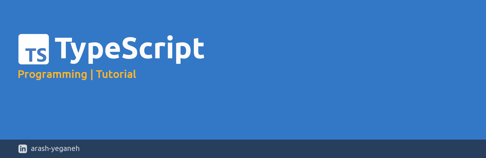

# TypeScript Tutorial


## What is TypeScript?

TypeScript, an open-source programming language, is crafted and nurtured by Microsoft. It extends JavaScript's capabilities by introducing static typing and additional features, all the while ensuring seamless compatibility with existing JavaScript code.

```
TypeScript = JavaScript + A type system
```

The TypeScript type system encompasses the following aspects:

- It aids in error detection during the development phase.
- It employs 'type annotations' to scrutinize our code.
- Its functionality is solely active during development.
- It does not offer any performance optimizations.

**TypeScript Process**
1. Write TypeScript Code
	```typescript
	function addNumbers(a: number, b: number): number {
    return a + b;
	}
	const sum: number = addNumbers(5, 10);
	console.log(`The sum is: ${sum}`);
	```
	
2. Use the TypeScript Compiler (tsc) to Transform TypeScript Code into Plain JavaScript
	
	```javascript
	"use strict";
	function addNumbers(a, b) {
	    return a + b;
	}
	const sum = addNumbers(5, 10);
	console.log(`The sum is: ${sum}`);
	```

## Installing the TypeScript Compiler

Install Node.js by following this [Link](https://nodejs.org/en), and then execute the following command in your terminal:

```bash
npm install -g typescript
```


